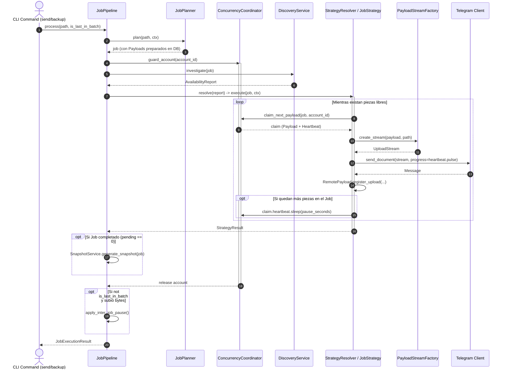

# ADR: Motor de Subida, Pipeline Declarativo y Estrategias Polimórficas

**Complementa a** | [Modelo de Concurrencia Declarativa y Leases Distribuidos](nuevo-modelo-fase-1.md) |


## Contexto

Antes de esta refactorización, el motor de subida presentaba un alto grado de acoplamiento y dispersión de responsabilidades:
1. **God-Class Monolítica (`UploadService`):** Una única clase concentraba transporte de red con Pyrogram, lógica de particionado TAR vs Archivo plano, control de leases, bifurcaciones de negocio (`if/elif`), pausas temporizadas y llamadas directas a la interfaz de usuario (Rich).
2. **Fuga de Abstracciones de I/O:** El cargador de archivos interactuaba directamente con detalles de bajo nivel de `tartape.Tape` y `FileVolume`, obligando al código de red a saber si estaba transmitiendo una carpeta o un archivo simple.
3. **Pausas Ambiguas e Ineficientes:** No existía una clara distinción entre pausas entre piezas del mismo archivo y pausas entre archivos de un lote, provocando esperas innecesarias al finalizar la última pieza.
4. **Flujo Imperativo:** El procesamiento de un archivo dependía de llamadas encadenadas sin contratos ni DTOs formales de retorno.

---

## Decisiones Arquitectónicas Adoptadas

### Decisión 1: Pipeline Lineal y Determinista (`JobPipeline`)
* **Qué se hizo:** Se desacopló el ciclo de vida de un recurso en 5 etapas secuenciales e independientes:
  $$\text{Plan} \longrightarrow \text{Account Guard} \longrightarrow \text{Discovery} \longrightarrow \text{Strategy Dispatch} \longrightarrow \text{Commit / Snapshot}$$
* **Motivo:** Cada etapa tiene entradas y salidas tipadas (DTOs). El pipeline es idempotente: si una subida se interrumpe y se reinicia, el pipeline continúa exactamente desde el estado guardado en la base de datos sin duplicar trabajo.

### Decisión 2: Patrón Estrategia Polimórfico (`JobStrategy`)
* **Qué se hizo:** Se eliminó la lógica de bifurcaciones condicionales reemplazándola por 3 estrategias concretas bajo una interfaz común `execute(job, ctx, report) -> StrategyResult`:
  * **`FulfilledStrategy`:** El recurso ya existe completo en el chat destino. Operación instantánea (cero I/O).
  * **`SmartForwardStrategy`:** El recurso existe en otro chat. Clona las piezas mediante `file_id` (Zero-byte network upload).
  * **`CooperativeUploadStrategy`:** Sube bytes físicos a Telegram consumiendo piezas atómicamente mediante `claim_next_payload`.

### Decisión 3: Aislamiento de I/O mediante Fábrica de Streams (`PayloadStreamFactory`)
* **Qué se hizo:** Se creó `PayloadStreamFactory`, que traduce cualquier registro `Payload` (sea archivo o volumen TAR) a un objeto estándar `UploadStream`.
* **Motivo:** El cliente de red (Pyrogram) solo interactúa con un flujo binario (`io.BufferedIOBase`) que encapsula el cálculo de hash MD5 on-the-fly, tamaño y nombres sanitizados, sin conocer `tartape` ni el sistema de archivos subyacente.

### Decisión 4: Jerarquía de Pausas en Dos Niveles (Intra-Job vs Inter-Job)
* **Qué se hizo:** Se estableció una separación estricta para el comportamiento de pausas:
  * **Pausa Intra-Job (Entre piezas del mismo archivo):** Es ejecutada por `CooperativeUploadStrategy` **únicamente si** tras subir la pieza actual aún quedan más piezas pendientes en ese Job (`Payload.total_pending_for_job(job) > 0`). Si era la última pieza, no se pausa.
  * **Pausa Inter-Job (Entre archivos distintos del lote CLI):** Es ejecutada por `JobPipeline` **únicamente si** el archivo actual subió bytes físicos y no es el último archivo de la cola (`not is_last_in_batch`).

### Decisión 5: Finalización y Generación de Snapshot sin Condiciones de Carrera
* **Qué se hizo:** La creación del snapshot se desacopló de las cuentas y se vinculó al estado atómico de la base de datos:
  * El worker que sube la pieza que reduce las piezas pendientes a cero (`pending == 0`) es el responsable de marcar el Job como `UPLOADED` y ejecutar `SnapshotService.generate_snapshot(job)`.

---

## Topología de Componentes

```
totelegram/
├── engine/
│   ├── factory.py          # PayloadStreamFactory (Abstracción de I/O)
│   ├── planner.py          # JobPlanner (Preparación idempotente de Source/Payloads)
│   ├── pipeline.py         # JobPipeline (Orquestador de ciclo de vida)
│   └── strategies/
│       ├── base.py         # Interfaz JobStrategy y StrategyResolver
│       ├── fulfilled.py    # Fast-path de recursos existentes
│       ├── forward.py      # Reenvío de mensajes (Smart Forward)
│       └── upload.py       # Worker cooperativo de transmisión física
```

---

## Secuencia de Ejecución Canónica


